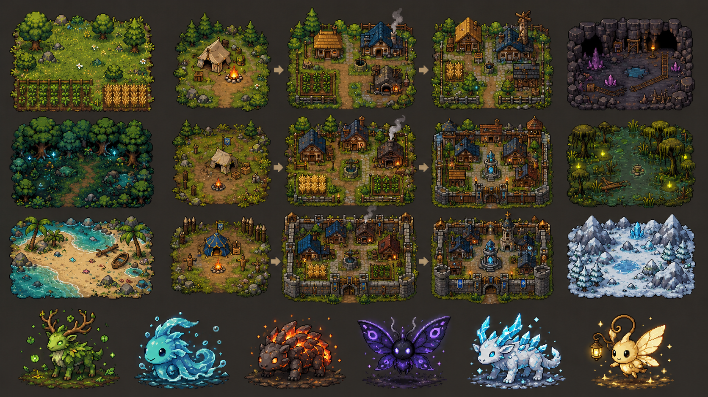

# Reinos de Valdria v4.25 — save persistente Phaser

Esta versão mantém a aventura atual totalmente jogável e acrescenta uma fundação moderna para a migração gradual.

Há duas entradas no mesmo projeto:

- \`index.html\`: jogo atual em Canvas, com renderização e comportamento preservados;
- \`modern.html\`: primeira área Phaser realmente explorável, carregada de um mapa TMJ.

O laboratório ainda não substitui a aventura. Ele existe para que dados, save, assets e sistemas possam migrar um por vez sem quebrar movimento, combate, Guardiões ou progresso.

## Começar em casa

O guia detalhado está em [PASSO_A_PASSO_EM_CASA.md](PASSO_A_PASSO_EM_CASA.md).

### Jeito rápido — jogar a versão atual

1. Extraia o ZIP.
2. Abra a pasta no VS Code.
3. Instale a extensão **Live Server**.
4. Clique com o botão direito em \`index.html\`.
5. Escolha **Open with Live Server**.

Esse modo não precisa de Node.js, mas abre somente o jogo legado.

### Jeito recomendado — projeto completo

Instale o Node.js LTS 20.19 ou superior e depois dê dois cliques em \`INICIAR_JOGO.bat\`. Na primeira vez, o arquivo instala os pacotes e abre o jogo.

Pelo terminal do VS Code:

\`\`\`bash
npm install
npm run dev
\`\`\`

Use os endereços:

- jogo atual: \`http://localhost:5173/\`;
- save persistente Phaser v4.25: \`http://localhost:5173/modern.html\`.

## O que entrou na v4.25

- carregamento do save v3 antes do menu;
- importação segura do save Canvas v2 sem apagá-lo;
- restauração de classe, posição, HP, mana, nível e XP;
- persistência de materiais e Núcleos de Essência;
- restauração de vínculo, HP, nível e XP de Folium;
- autosave a cada cinco segundos, na saída e após vínculo;
- HUD com estado da gravação;
- teste real de recarregamento pelo IndexedDB;
- documentação em [save-persistente-v4.25.md](docs/save-persistente-v4.25.md).

Mantidos da v4.24:

- Folium permanece visível depois do vínculo;
- companheiro segue o jogador e o alvo selecionado;
- ataque automático com dano do catálogo;
- metade do XP no golpe final, como no Canvas;
- nível e crescimento de HP do Guardião;
- Raiz Vital automática durante combates;
- HUD com Guardião ativo e nível;
- testes de progressão e decisão de cura;
- documentação em [folium-companheiro-v4.24.md](docs/folium-companheiro-v4.24.md).

Mantidos da v4.23:

- Folium selvagem carregado pelo objeto \`guardian_spawns\`;
- dados de espécie vindos de \`catalogs.json\`;
- seleção e enfraquecimento até o mínimo de 1 HP;
- fórmula de vínculo preservada do Canvas;
- comando \`V\` e botão mobile \`VÍNCULO\`;
- três Núcleos de Essência provisórios para teste;
- primeira equipe provisória após o vínculo;
- testes de dados, enfraquecimento e chance;
- documentação em [primeiro-vinculo-v4.23.md](docs/primeiro-vinculo-v4.23.md).

Mantidos da v4.22:

- estados de IA para espera, perseguição, ataque, retorno e derrota;
- detecção diferente para criaturas territoriais e de emboscada;
- limite de território e retorno automático ao spawn;
- respawn seguro após oito segundos;
- bloqueio de sobreposição entre jogador e monstros;
- bloqueio de sobreposição entre monstros;
- testes puros de IA, respawn e separação circular;
- revisão dos repositórios relevantes sem nova dependência;
- documentação em [ia-respawn-v4.22.md](docs/ia-respawn-v4.22.md).

Mantidos da v4.21:

- Javali Musgoso e Esporo Errante como espécies originais dos Campos;
- quatro spawns combatíveis distribuídos pelo mapa;
- carregamento genérico de monstros pelo \`catalogId\` do TMJ;
- HP, dano, experiência e drops próprios por espécie;
- visão e velocidade adaptadas conforme o comportamento;
- formas provisórias originais geradas pelo Phaser;
- testes dos IDs, atributos e drops;
- documentação em [bestiario-campos-v4.21.md](docs/bestiario-campos-v4.21.md).

Mantidos da v4.20:

- mana própria e regeneração gradual para cada classe;
- Golpe do Cavaleiro, Tiro do Arqueiro e Flama do Mago;
- custos, alcances e cooldowns vindos de \`catalogs.json\`;
- dano ampliado das habilidades e área de efeito da Flama;
- ativação por \`Q\` ou botão mobile \`HABILIDADE\`;
- HUD de mana, habilidade e recarga;
- regras puras e testes de mana e multiplicador de dano;
- documentação em [habilidades-e-mana-v4.20.md](docs/habilidades-e-mana-v4.20.md).

Mantidos da v4.19:

- seleção de Cavaleiro, Arqueiro ou Mago antes da exploração;
- HP, dano, alcance e intervalo próprios vindos de \`catalogs.json\`;
- ataque corpo a corpo para Cavaleiro;
- projéteis provisórios para Arqueiro e Mago;
- aparência provisória diferente para cada classe;
- testes das três configurações e dos limites de alcance;
- documentação em [classes-e-ataques-v4.19.md](docs/classes-e-ataques-v4.19.md).

Mantidos da v4.18:

- Ratinos instanciados a partir de \`monster_spawns\` do TMJ;
- seleção de alvo por toque/clique;
- ataque com \`F\` ou botão \`ATACAR\`;
- HP, dano, alcance, cooldown, visão, movimento, XP e drops vindos de \`catalogs.json\`;
- IA simples de detecção, aproximação e ataque;
- desmaio e retorno ao acampamento sem alterar o save;
- HUD provisório de HP, nível, XP e alvo;
- regras puras e testes de paridade numérica do combate.

Mantidos da v4.17:

- Playwright e Chromium para testes reais do Phaser;
- cenários desktop e mobile horizontal;
- testes de abertura sem erros, câmera, minimapa, teclado diagonal e toque com A*;
- validação de que o Canvas cabe no viewport mobile;
- correção do ciclo de imports entre configuração e cenas;
- dimensões movidas para \`src/game/dimensions.ts\`;
- acesso de diagnóstico disponível somente no servidor de desenvolvimento.

Mantidos da v4.16:

- caminho A* em oito direções para toque, contornando água e obstáculos;
- diagonais do A* impedidas entre duas quinas bloqueadas;
- minimapa com terreno, estradas, água, obstáculos, jogador e área da câmera;
- interação por \`E\`, espaço ou botão mobile \`AÇÃO\`;
- respostas provisórias para NPCs, baús, santuários e portais;
- regras puras e testes para pathfinding e proximidade.

Mantidos da v4.15:

- mapa TMJ de Campos de Valdria com 48 × 32 tiles de 32 px;
- tile layers \`ground\`, \`roads\`, \`water\`, \`obstacles\`, \`decoration\` e \`collision\`;
- object layers para jogador, NPCs, monstros, Guardiões, baús, santuários, portais, aldeia e bioma;
- tileset vetorial original e provisório, compatível com Tiled;
- movimento por WASD/setas, diagonal normalizada, bloqueio de quinas e colisão;
- câmera acompanhando o jogador, toque para mover e controle virtual mobile;
- validação automática do TMJ e dos IDs contra \`catalogs.json\`;
- 6 testes para dimensões, layers, spawn, colisão, IDs e movimento.

Mantidos da v4.14:

- fonte única em \`src/game/data/catalogs.json\` para classes, biomas, Guardiões, itens e monstros;
- ponte gerada em \`public/game/00-content-bridge.js\` para o JavaScript clássico;
- remoção dos atributos duplicados de \`02-entities-content.js\` e \`03-guardians.js\`;
- paridade numérica de HP, mana, dano, alcance, cooldown, XP, drops e vínculo;
- 4 novos testes de paridade da ponte;
- documentação em [dados-migrados-v4.14.md](docs/dados-migrados-v4.14.md).

Mantidos da v4.13:

- Phaser 3.90 em uma entrada separada, com \`BootScene\`, \`MenuScene\`, \`WorldScene\` e \`UIScene\`;
- TypeScript estrito e build multi-página com Vite;
- catálogos Zod para 6 biomas, 3 classes, 6 Guardiões, monstros, itens, missões e aldeias;
- progressão jogável de Acampamento → Aldeia Viva → Aldeia Fortificada;
- regras puras de dano, experiência, vínculo e transições de estado;
- save v3 validado, armazenamento Dexie/IndexedDB e migração do \`localStorage\` v2;
- Howler encapsulado em canais separados de música e efeitos;
- PWA com manifest, cache de produção e ícone original provisório;
- pipeline de assets 32 × 32, manifesto e registro de licenças;
- prancha original de direção visual, mantida como conceito e não como spritesheet;
- testes de paridade, smoke do jogo, dados, regras, aldeia e migração;
- todos os 86 repositórios documentados com decisão individual.

## Os 86 repositórios

Eles estão todos contabilizados em:

- [matriz de adoção dos 86 repositórios](docs/matriz-de-adocao-dos-86-repositorios.md);
- [guia original recebido](docs/guia-original-86-repositorios.md).

Sete tecnologias entram como dependências reais nesta etapa: Phaser, Zod, Vitest, Dexie, Vite, vite-plugin-pwa e Howler. Tiled é uma ferramenta externa planejada. Engines concorrentes, multiplayer, projetos arquivados e repositórios de estudo continuam documentados sem serem instalados desnecessariamente.

## Estrutura principal

\`\`\`text
reinos-de-valdria/
├── index.html                    # aventura atual preservada
├── modern.html                   # laboratório da arquitetura nova
├── public/
│   ├── game/                     # ponte gerada + 12 módulos clássicos
│   ├── styles/game.css
│   ├── assets/                   # pipeline de arte e áudio
│   └── icons/
├── src/
│   ├── main.ts
│   ├── game/
│   │   ├── assets/
│   │   ├── audio/
│   │   ├── data/                 # catalogs.json é a fonte canônica
│   │   ├── maps/                 # validação do mapa TMJ
│   │   ├── save/
│   │   ├── scenes/
│   │   └── systems/
│   └── styles/
├── tests/
│   ├── game-smoke.test.js
│   └── foundation/
├── docs/
├── scripts/
└── legacy/                       # HTML original para recuperação
\`\`\`

Consulte [arquitetura-v4.13.md](docs/arquitetura-v4.13.md) antes de mover uma mecânica do legado.

## Comandos

\`\`\`bash
# desenvolvimento
npm run dev

# paridade + smoke + testes da fundação
npm test

# TypeScript
npm run typecheck

# confirma os 86 links
npm run verify:repos

# confirma arquivos e licenças dos assets
npm run verify:assets

# confirma estrutura, colisão e IDs do mapa TMJ
npm run verify:map

# todos os testes, verificações e build
npm run check

# primeira instalação do navegador de testes
npx playwright install chromium

# check normal + testes reais desktop/mobile
npm run check:full

# build de produção em dist/
npm run build
npm run preview
\`\`\`

## Onde editar

| Objetivo | Local |
|---|---|
| Corrigir a aventura atual | \`public/game/01-…12-*.js\` |
| Alterar classe, bioma, Guardião, item ou monstro | \`src/game/data/catalogs.json\` |
| Alterar o primeiro mapa | \`scripts/generate-fields-map.mjs\` e depois \`npm run generate:map\` |
| Criar missão | \`src/game/data/quests.ts\` |
| Alterar evolução de aldeia | \`src/game/data/villages.ts\` e \`systems/village.ts\` |
| Alterar o novo save | \`src/game/save/\` |
| Adicionar asset | \`public/assets/\`, \`manifest.json\` e \`ASSET_LICENSES.md\` |
| Migrar renderização | \`src/game/scenes/\` |

## Garantia de segurança

\`npm run test:parity\` confirma que o HTML e o CSS permanecem iguais, que o original arquivado não mudou e que a ponte é carregada antes dos 12 módulos. Os testes da fundação comparam os números gerados aos catálogos. O save novo não apaga o antigo: a migração lê o formato v2, valida o resultado e grava em IndexedDB quando o novo cliente assumir essa responsabilidade.

Detalhes estão em [testes-de-exploracao-v4.17.md](docs/testes-de-exploracao-v4.17.md), [exploracao-v4.16.md](docs/exploracao-v4.16.md) e [mapa-campos-de-valdria-v4.15.md](docs/mapa-campos-de-valdria-v4.15.md).
